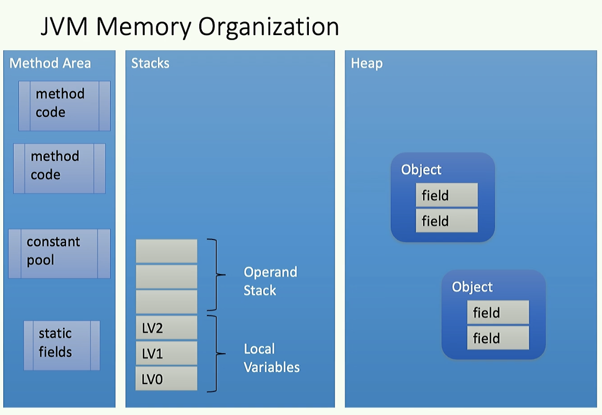

# Lesson 2

Date: 2024-09-18

## What are the possible program representation?

We have representation that differs in terms of size of the elements of the representation:

Instruction level -> Basic block -> Control Flow Graph -> Functions -> Call graph -> OO: Classes -> OO: Class hierarchy graph -> Program

It is very difficult to identify all the code that a program is executing.

## JVM Memory organization?



Method Area: stores the method code, and the static fields. The literals are stored in the method area too, called constant pool.

Stacks: we have the operand stack and the local variables

Heap: stores objects and their fields

## Types in the JVM

boolean, byte, char, short, int: are all represented with an integer
float: float
long: long
double: double

Arrays: [I array of integer, [[I array of array of integer

## Data, Types and operation in different layers
Locations: Local 

## Basic JVM operation: return a sum

Source:
```
return 1+2+3;
```

Bytecode:
```
iconst_1
iconst_2
iadd
iconst_3
ireturn
```

Alternative solution:
```
bipush 1
bipush 2
iadd
bipush 3
iadd
ireturn
```

## Boolean expression
Source:
```
return true & false;
```

Bytecode:
```
iconst 1 // true value
iconst 0 // false value
iand
ireturn
```

## Bitwise and
Source:
```
return 3 & 1; //bitwise and 
```

Meaning:
```
011 & 001 = 001
```

## Local Variable
Source:
```
int i = 3;
int j = i + 1;
```

Bytecode:
```
iconst_3
istore_0
iload_0
iconst_1
istore_1
```

## Boolean to int
Source:
```
int i = true;
return i;
```

Bytecode:
```
iconst_1
istore_0

iload_0
ireturn
```

## Cast
Source:
```
double d = 3.1;
int i = (int)d;
```

Bytecode:
```
ldc #3.1 // from the constant pool
dload_0
d2i
istore_1
```

